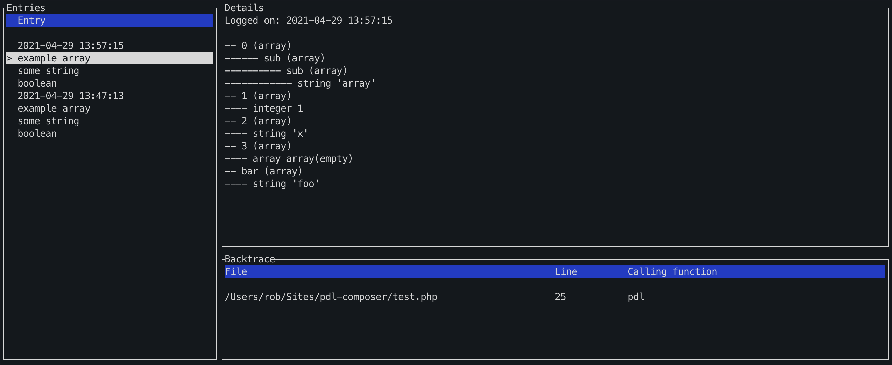

# Universal debug logger



Universal debug logger is a small terminal application written to be the middle ground between var dumping/console printing and step debugging.

It is not made to replace either of these, but rather to be an additional tool in the toolset.

This is a hobby project, I am not super familiar with rust yet, all suggestions are welcome.

## Language implementations

## Expected format

UDL listens by default on port 9337, you can specify a port by running `udl 1337` for example.

From any language you can send a tcp request with a json payload:

Example for an object:

```
{
   "time":"2021-04-29 13:57:15",
   "data":{
      "object":{
         "Test#1":{
            "bar":{
               "string":"'foo'"
            },
            "Test:false":{
               "boolean":"true"
            }
         }
      }
   },
   "label":"2021-04-29 13:57:15",
   "backtrace":[
      {
         "file":"\/Users\/rob\/Sites\/pdl-composer\/test.php",
         "line":40,
         "function":"pdl"
      },
      {
         "file":"\/Users\/rob\/Sites\/pdl-composer\/test.php",
         "line":45,
         "function":"pdl",
         "class":"Test",
         "type":"->"
      }
   ]
}
```

The label is used for displaying in the entries list, and may be duplicated.

## How to interact

`j/k` for going up and down the entries list.
`q` to quit.

## known issues

Sometimes you cannot quit.. close the process or terminal window.

Might crash, I dont know.

Everything is kept in memory.

## Building

You basically need to install rust etc to run this at the moment, I do not have spend any time setting up a ci
to provide pre build binaries, this is just a proof of concept.

Build from source:

- `cargo build` for dev build.
- `./target/debug/udl 9337`
